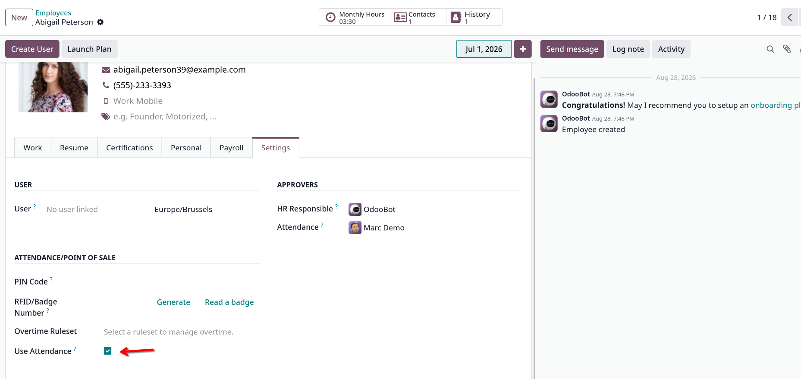

# HR Attendance Employee Filter

Exclude specific employees from the Odoo Attendance application when they do not participate in attendance tracking.

## Overview

By default, Odoo Attendance can display active employees in the Attendance application and Kiosk Mode, even when some employees are not required to use attendance.

For example, management staff, external consultants, or other employees may exist in the HR system but should not be required to check in or check out.

**HR Attendance Employee Filter** adds a simple configuration option to each employee that allows HR users to define whether the employee should participate in attendance management.

This provides a clean and configurable way to control which employees are displayed in Attendance-related interfaces without deactivating the employee or modifying Odoo core code.

## Features

* Add an **Use Attendance** option to employees.
* Include or exclude employees from Attendance management.
* Prevent non-attendance employees from appearing in Attendance employee lists.
* Support Attendance Kiosk employee selection.
* Keep employees active in Odoo HR.
* No modification of Odoo core files.
* Simple configuration for HR users.
* Compatible with standard Odoo employee management.

## Example

An employee can remain active in Odoo while being excluded from Attendance:

| Employee   | Active | Use Attendance |
| ---------- | ------ | -------------- |
| John Doe   | Yes    | Yes            |
| Mary Smith | Yes    | Yes            |
| CEO        | Yes    | No             |
| Consultant | Yes    | No             |

The Attendance application will only consider employees with **Use Attendance** enabled.

## Configuration

Open an employee from:

**Employees → Employees → Employee**

Enable or disable:

> **Use Attendance**

### Employee using Attendance

```text
Employee: John Doe

Use Attendance: ☑
```

John Doe will be available in Attendance interfaces.

### Employee not using Attendance

```text
Employee: CEO

Use Attendance: ☐
```

The employee remains active and available in the HR application but is excluded from Attendance management.

## Why not deactivate the employee?

Deactivating an employee is not an appropriate solution because the employee may still be an active employee of the company.

For example:

```text
Employee
 ├── Active: Yes
 └── Use Attendance: No
```

This module separates the employee's HR status from their participation in the Attendance application.

This is especially useful for:

* Executives
* Directors
* External consultants
* Remote workers who do not use Odoo Attendance
* Employees managed through another attendance system
* Employees who are not required to check in/out

## Technical Approach

The module extends the standard `hr.employee` model with an attendance participation flag.

```python
use_attendance = fields.Boolean(
    string="Use Attendance",
    default=True,
)
```

Attendance-related employee selections are then filtered according to this configuration.

The module follows Odoo's standard inheritance mechanisms and does not modify the original Odoo source code.

## Compatibility

| Odoo Version | Status      |
| ------------ | ----------- |
| Odoo 19.0    | ✅ Supported |

## Dependencies

This module depends on:

* `hr`
* `hr_attendance`

## Installation

1. Copy the module into your Odoo custom addons directory.

```text
custom_addons/
└── hr_attendance_employee_filter/
```

2. Restart the Odoo server.

3. Update the Apps list.

4. Search for:

```text
HR Attendance Employee Filter
```

5. Install the module.

## Development

Clone the repository into your custom addons directory and restart Odoo with the module path configured.

Example:

```bash
./odoo-bin \
    --addons-path=addons,custom_addons \
    -d your_database
```

To update the module:

```bash
./odoo-bin \
    --addons-path=addons,custom_addons \
    -d your_database \
    -u hr_attendance_employee_filter
```

## Design Principles

This module intentionally avoids solutions based on:

* Deactivating employees
* Employee job titles
* Employee names
* Hard-coded employee IDs
* CSS-only filtering
* JavaScript-only filtering

Instead, attendance participation is explicitly configured on the employee.

This makes the solution easier to maintain and adapt to different business requirements.

## Use Case

Consider a company with 100 employees.

Only 80 employees are required to use Odoo Attendance.

Without this module, all active employees may appear in Attendance-related interfaces.

With this module:

```text
100 Active Employees
        │
        ▼
Use Attendance?
        │
   ┌────┴────┐
  YES        NO
   │          │
   ▼          ▼
Attendance   HR only
```

This allows HR to maintain a complete employee database while keeping Attendance focused only on employees who actually use the system.

## Odoo Community

This module addresses a common customization requirement in Odoo Attendance: controlling which employees participate in attendance tracking independently from their active employee status.

## License

LGPL-3

## Author
Jardel Elias Bernardo

Developed for Odoo customization and community use.

## Contributing

Contributions, bug reports, and improvement suggestions are welcome.

When submitting an issue, please include:

* Odoo version
* Module version
* Steps to reproduce the problem
* Expected behavior
* Actual behavior
* Relevant logs or screenshots

## Credits

This module extends Odoo's standard:

* `hr.employee`
* `hr_attendance`

without modifying Odoo core code.



